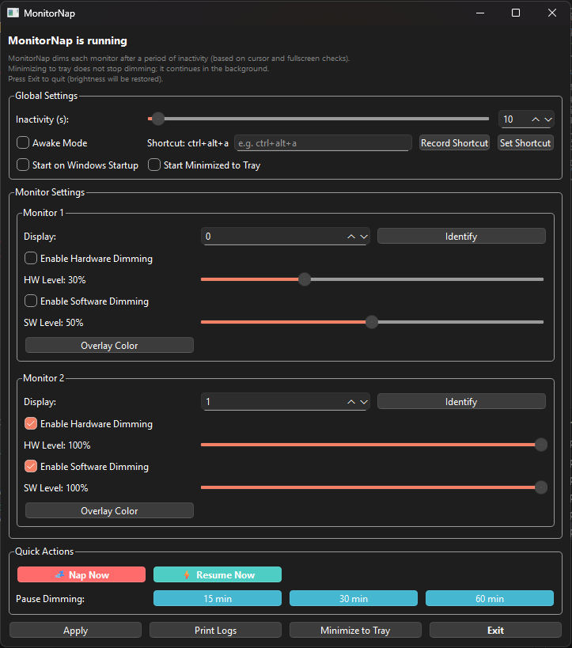

# MonitorNap

**📥 Download:** [monitornap.exe](https://github.com/BDenizKoca/MonitorNap/releases/latest/download/monitornap.exe) (37MB) | [All Releases](https://github.com/BDenizKoca/MonitorNap/releases)

MonitorNap dims your monitors after inactivity using hardware (DDC/CI) and/or a software overlay. It runs in the system tray and supports a global hotkey for "Awake Mode".

---



## Features
- Per-monitor inactivity detection (cursor and fullscreen checks)
- Hardware dimming via DDC/CI (monitorcontrol)
- Software dimming overlay with color/opacity
- System tray menu, start minimized, and Windows startup registry
- Global hotkey (via `keyboard`) to toggle Awake Mode

---

## Why I Built It
I was getting blinded by my second monitor but I also get tired of having to constantly switch it on/off so I made this. This enables me to keep my second monitor working without being distracting.

---

## Installation

### **Quick Start (Recommended)**
1. **Download:** [monitornap.exe](https://github.com/BDenizKoca/MonitorNap/releases/latest/download/monitornap.exe) (37MB) - No installation required!
2. **Run:** Double-click the executable
3. **Configure:** Use "Identify" to map your monitors
4. **Optional:** Enable "Start on Windows Startup"

### **Run from Source**
```powershell
# Clone the repository
git clone https://github.com/BDenizKoca/MonitorNap.git
cd MonitorNap

# Create virtual environment
python -m venv .venv
.\.venv\Scripts\Activate.ps1

# Install dependencies
pip install -r requirements.txt

# Run the application
python monitornap.py
```
---

### Requirements
- **Windows 10/11** (tested)
- **Python 3.8+** (if running from source)
- **DDC/CI capable monitors** (for hardware dimming)
- **Administrator privileges** (for global hotkey registration)

---

## Usage

### First Time Setup
1. **Launch MonitorNap** - The main window opens
2. **Configure monitors** - Use "Identify" to see which display is which
3. **Adjust settings** - Set inactivity timer and dimming levels
4. **Test it** - Wait for inactivity or click "Nap Now"

### Main Window Controls

#### Global Settings
- **Inactivity Limit** - Seconds before dimming (1-3600)
- **Awake Mode** - Prevents all dimming when enabled
- **Global Hotkey** - Key combination to toggle Awake Mode
- **Startup Options** - Auto-start and minimize to tray

#### Per-Monitor Settings  
- **Display Selector** - Choose which display gets the overlay
- **Identify Button** - Flash overlay to identify the monitor
- **Hardware Dimming** - Enable DDC/CI brightness control (30% default)
- **Software Dimming** - Enable overlay dimming (50% opacity default)
- **Overlay Color** - Customize the dimming overlay color

#### Quick Actions
- **Nap Now** - Immediately dim all monitors
- **Resume Now** - Immediately restore all monitors  
- **Pause 15/30/60 min** - Temporarily disable dimming
- **Awake Mode Toggle** - Keep monitors always active

### System Tray
Right-click the tray icon for quick access to:
- Show/Hide main window
- Toggle Awake Mode
- Nap Now / Resume Now
- Pause Dimming (15/30/60 minutes)
- Exit application

### Hotkeys
- **Ctrl+Alt+A** (default) - Toggle Awake Mode globally
- **Record custom hotkey** - Use "Record Shortcut" button

### Configuration
Settings are automatically saved to:
```
%APPDATA%\MonitorNap\monitornap_config.json
```

---

## Known Limitations

- **Monitor index mapping** may differ between Windows enumerations and monitorcontrol; if dimming the wrong screen, use the Display selector to map correctly
- **Fullscreen detection** is heuristic and may not catch all cases (some games/apps may still dim)
- **DDC/CI support varies** by monitor manufacturer - some monitors don't support hardware brightness control
- **USB monitors** typically don't support DDC/CI and will only use software overlay
- **Multiple identical monitors** may be harder to distinguish without using Identify

---

## License

MIT License - You can use, modify, and distribute freely with attribution.
